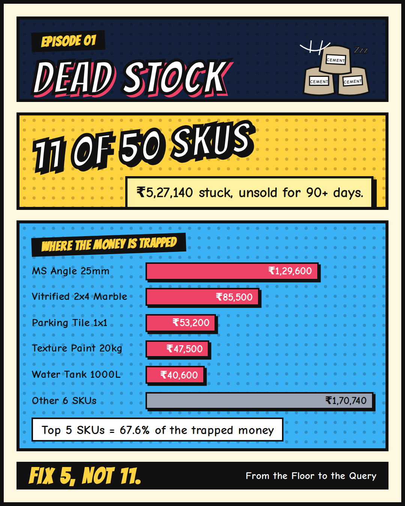

[← Back to all episodes](../README.md)

# Episode 1: Dead Stock

## The business problem
In a store run on a paper register, a slow item never looks like a problem. Nobody sees how long it has sat there or
how much money it holds. Cement hardens, paint ages, and rent is paid on the shelf either way.
Dead stock is cash you spent that has stopped coming back.

## The question
Which SKUs have stopped selling, how many rupees are locked in them, and which few should be fixed first?

## Approach
1. Find each SKU's last sale date and its 90-day sales quantity.
2. `LEFT JOIN` from products, so SKUs that **never sold** still appear.
3. Label each SKU: **Dead** (no sale in 90+ days), **Slow** (60+ days idle or 180+ days of cover), or **Moving**.
4. Use a window function for a running share of dead-stock value (a Pareto view).

## Results (synthetic data, 50 SKUs, as of 30 Sep 2026)
- **11 of 50 SKUs are dead**, holding **Rs 5,27,140**, which is 14.6% of total stock value (Rs 36,17,825).
- The **top 5 dead SKUs hold 67.6%** of the trapped money. Fix 5, not 11.

| SKU | Product | Stock | Locked value (Rs) | Days idle | Cumulative share |
|---|---|---|---|---|---|
| SKU012 | MS Angle 25mm | 180 | 1,29,600 | 108 | 24.6% |
| SKU018 | Vitrified 2x4 Marble | 90 | 85,500 | 130 | 40.8% |
| SKU017 | Parking Tile 1x1 | 140 | 53,200 | 115 | 50.9% |
| SKU033 | Texture Paint 20kg | 25 | 47,500 | 150 | 59.9% |
| SKU038 | Water Tank 1000L | 7 | 40,600 | 160 | 67.6% |
| SKU031 | Distemper 20kg | 30 | 40,500 | 122 | 75.3% |
| SKU020 | Border Tile Gold | 60 | 37,200 | 170 | 82.4% |
| SKU048 | Bathroom Mirror | 22 | 31,900 | 140 | 88.4% |
| SKU023 | Epoxy Grout 1kg | 36 | 23,040 | 98 | 92.8% |
| SKU047 | Health Faucet | 40 | 19,200 | 101 | 96.4% |
| SKU030 | Enamel Red 1L | 45 | 18,900 | 105 | 100.0% |

## Files
| File | What it is |
|---|---|
| `sql/dead_stock_analysis.sql` | The full query (4 CTEs + window function) |
| `data/products.csv` | 50 SKUs with cost price and current stock |
| `data/sales.csv` | 180 days of sales rows |
| `generate_data.py` | Script that rebuilds the synthetic data (seeded, repeatable) |
| `cover.png` | Episode cover image |

## How to run
1. Load `data/products.csv` and `data/sales.csv` into PostgreSQL, DuckDB or Snowflake as tables `products` and `sales`.
2. Run `sql/dead_stock_analysis.sql`.
3. On Snowflake or SQL Server, replace date subtraction with `DATEDIFF('day', start, end)`.

## Limits to keep in mind
- **Out of stock looks like slow.** A SKU with no sales may have been empty on the shelf. Check stock history first.
- **Seasonality.** A flat 90-day rule flags seasonal items unfairly (cement in monsoon, paint before festivals).
- **Cost, not selling price.** Values show money paid, not money that would have been earned.
- **Synthetic data.** Real data will need cleaning (dates, returns, duplicates) before this runs cleanly.

## Level up
Add a `shelf_life_days` column so cement gets a shorter cut-off than hardware, then rank by days left, not days idle.
